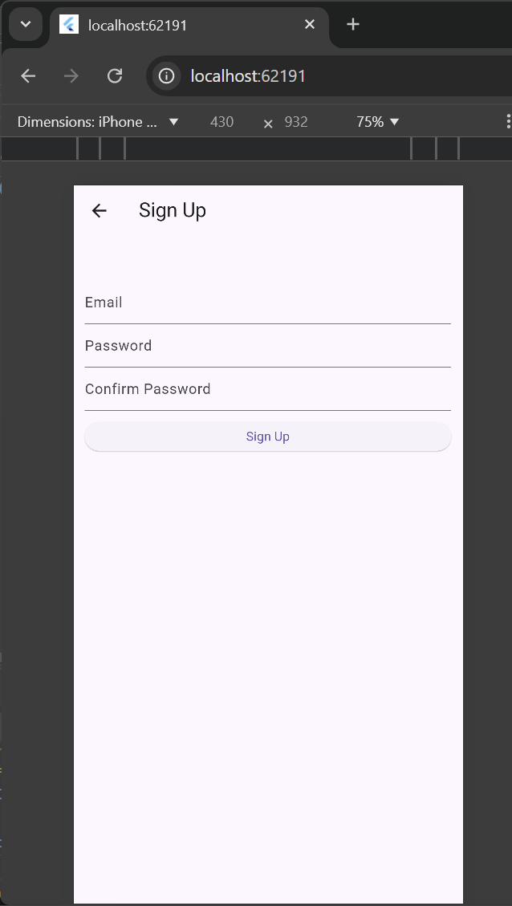
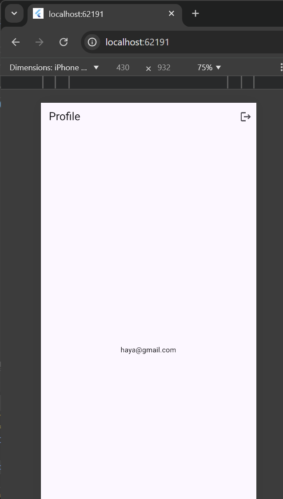

# final_project

## Overview
This is the final project for the Flutter Bootcamp.
Currently, only specific pages are functional and available for testing.

## Functional Pages
The following pages are functional and can be tested:

1. **Login Page**
   - **Description:** Allows users to log in with their credentials.
   - **Preview:**
     

2. **Signup Page**
   - **Description:** Enables new users to create an account.
   - **Preview:**
     

3. **Profile Page**
   - **Description:** Displays the user's profile information. Currently, this page only shows the user's email to confirm that it is functioning correctly. No additional features have been added yet.
   - **Preview:**
     
